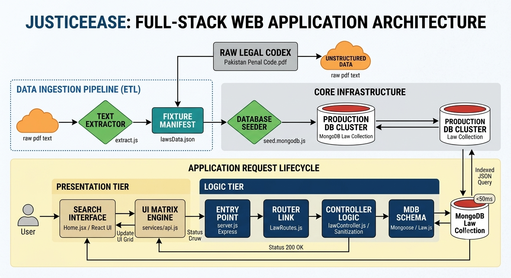

# JusticeEase
JusticeEase is a full-stack web application designed to democratize legal literacy by translating unstructured law documents into an easily searchable, structured digital repository. Focused on the Pakistan Penal Code (PPC), the platform allows users to explore complex legal statutes using regular, everyday language with absolute confidence.

## System Architecture & Application Flow
The system operates across three tightly integrated tiers: data ingestion, application runtime backend infrastructure, and a responsive frontend interface.

### Architecture Blueprint (flow.png)
The comprehensive operational pipeline is outlined in the diagram below:

Figure 1: Complete ETL pipeline and HTTP request-response lifecycle mapping backend logic matrices down to database indices.

### Process Decomposition
Data Ingestion Pipeline (ETL): Raw unstructured texts extracted from legal source documents (e.g., Pakistan Penal Code.pdf) are routed through a node-based parser utility (extract.js). The raw data is transformed into a structured JSON database fixture lawsData.json. This manifest is then processed by a database hydration script (seed.mongodb.js) to systematically seed the production database collections.

Application Request Lifecycle:

Presentation Tier: The client fires asynchronous HTTP queries initiated through a search component (Home.jsx) or via the core Axios configuration wrapper (api.js).

Logic Tier: Requests hit the Express entryway server gateway (server.js), which processes endpoints managed under specific pipelines (LawRoutes.js). The traffic lands on specialized request handlers (lawController.js) tasked with parsing, sanitizing, and implementing legal keyword queries.

Data Tier: The controllers interface with the data layout using Mongoose database abstractions (Law.js), requesting indexed JSON queries directly from the MongoDB engine with lookup latency benchmarks operating under 50ms.

## Repository File Matrix
Plaintext
justice-project/
├── justice-backend/
│   ├── config/          # Database connection pools & environment state
│   ├── controllers/     # Request handlers & legal query sanitization logic (lawController.js)
│   ├── models/          # Mongoose data structures & strict schemas (Law.js)
│   ├── routes/          # Express API endpoints & middleware pipelines (LawRoutes.js)
│   ├── scripts/         # Database hydration utilities (seed.mongodb.js)
│   ├── server.js        # Main backend engine gateway & port configurations
│   └── package.json     # Server dependency manifest
│
└── justice-frontend/
    ├── public/          # Global static web server assets
    ├── src/
    │   ├── assets/      # Shared layout components, branding icons, and images
    │   ├── components/  # Reusable dashboard UI element matrices
    │   ├── services/    # Axios configurations & async API endpoints (api.js)
    │   ├── views/       # Primary route view viewports (Home.jsx)
    │   ├── App.jsx      # Component application shell mapping
    │   └── main.jsx     # Client UI initialization anchor
    └── package.json     # Client dependency configuration manifest
## User Interface Viewports

### Platform Hero Portal (ui-main.png.jpg)
The primary gateway introduces the portal identity, featuring clean navigation pathways and an elegant, themed context designed around high accessibility.

### Legal Search Manifest Engine (ui-results.png.jpg)
Queries return clean UI grids showcasing granular law segments parsed directly out of multi-page data sources.

## Database Architecture & Models
Data is managed inside MongoDB collections using strict validation schemas configured inside Mongoose models.

### Legal Statutes Collection (db-documents.png.png)
Law text targets are broken down from document nodes directly into individual objects inside the laws database collection.

### Registered User Matrix (db-collections.png.png)
User records hold access controls using highly secure encrypted hashing mechanisms to ensure safe platform authorization workflows.

Figure 5: Secured users schema containing generated object identifiers, unique account emails, and pre-encrypted character passwords.

## API Gateway Integration & Validation
The application backend exposes secure REST endpoints, verified here through structural execution testing using API client platforms.

### User Registration Flow (api-register.png.png)
Endpoint: POST /api/auth/register

Payload Type: application/json

### Session Authorization Flow (api-login.png.png)
Endpoint: POST /api/auth/login

Payload Type: application/json

## Installation & Setup Instructions
### Prerequisites
Node.js (v18+ recommended)

MongoDB Instance (Local Community Server or Atlas Cluster)

### Backend Configuration
Navigate to the backend workspace directory:

Bash
cd justice-backend
Install code dependency manifests:

Bash
npm install
Initialize the development server:

Bash
npm run dev
### Frontend Setup
Open a new terminal matrix workspace and switch directories:

Bash
cd justice-frontend
Install UI packages and modules:

Bash
npm install
Boot the local presentation runtime client server:

Bash
npm run dev
